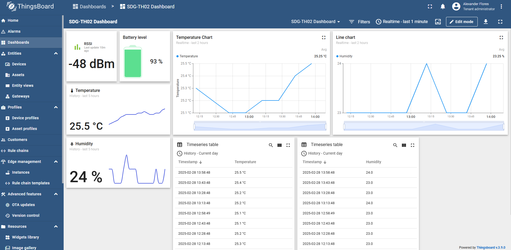
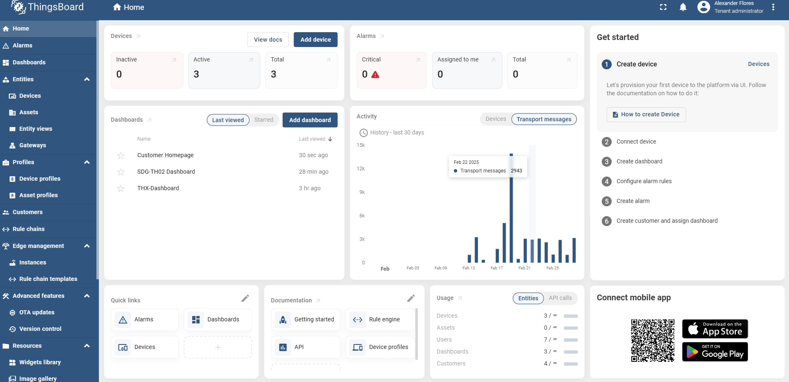

# **ThingsBoard IoT‑översikt (Delta.Acandia)**

### **Författare**: Alexander Flores

---

## **Introduktion**

Det här arkivet ger en **kortfattad översikt** över projektet **Delta.Acandia** och visar hur **ThingsBoard** används för att förena och visualisera IoT‑data från flera leverantörer i ett enda, säkert dashboard. Dokumentet belyser projektets syfte, arkitektur, nyckelutmaningar, skalbarhetsplan och framtida förbättringar — allt destillerat till det viktigaste utan detaljerade installationsanvisningar.

---

## **Varför ThingsBoard och projektet Delta.Acandia?**

**Acandias vision** är att erbjuda en nyckelfärdig *tjänst* som låter kunder **samla in, visualisera och styra enheter från flera leverantörer i en och samma, leverantörsoberoende portal**.
Kodnamnet för denna satsning är **Delta.Acandia**, där **Δ (Delta)** symboliserar det *förändrings‑ och översättningslager* som enhetligar olika datakällor till en sammanhängande upplevelse.

### Varför vi valde ThingsBoard

1. **Leverantörsoberoende & multiprotokoll** – Inbyggt stöd för MQTT, HTTP och CoAP samt gateway‑tillägg gör det möjligt att ansluta allt från batteridrivna sensorer till industriella PLC\:er.
2. **Rika visualiseringsverktyg** – En dra‑och‑släpp‑baserad dashboard‑byggare möjliggör snabb framtagning av skräddarsydda vyer utan extra kod.
3. **Regelmotor & tvåvägskontroll** – Serversidiga regelkedjor ger realtidslarm, automation och enhetskommandon i samma plattform, vilket eliminerar behovet av specialskrivna mellanlager.
4. **Skalbarhet & öppen källkod** – Horisontell skalning och Apache 2.0‑licens passar vår långsiktiga plan att flytta arbetslaster mellan on‑prem och moln utan inlåsning.
5. **Aktivt community & utbyggbarhet** – Färdiga widgets, REST‑API\:er och ett levande ekosystem accelererar utvecklingen och minskar underhållskostnaden.

Genom att bygga på **ThingsBoard** uppfyller **Delta.Acandia** sitt uppdrag: *ett dashboard där våra kunder säkert kan övervaka och interagera med heterogena IoT‑flottor i stor skala*.

---

## **Systemarkitektur**

Följande diagram visar dataflödet från IoT‑enheter till ThingsBoard‑instrumentpanelen:


### **Huvudfunktioner**

* ✅ **ThingsBoard‑server** (körs lokalt, ej i Docker)
* ✅ **ThingsBoard Gateway (tb‑gateway)** (Docker‑baserad)
* ✅ **MQTT‑kommunikation** för insamling av sensordata
* ✅ **Säker åtkomst med HTTPS & SSL/TLS**
* ✅ **Portvidarebefordran & nätverkskonfiguration**
* ✅ **Skalbarhets‑ och framtidsplaner**

---

## **Arkitekturkomponenter**

* **ThingsBoard‑server**: Huserar UI och backend‑logik.
* **ThingsBoard Gateway (tb‑gateway)**: Hanterar MQTT‑kommunikation med enheter.
* **IoT‑enheter**: Skickar temperatur‑ och luftfuktighetsdata via MQTT.
* **Nginx Reverse Proxy**: Säkerställer HTTPS‑åtkomst.
* **Databas**: Lagrar enhetstelemetri.

### **Arbetsflöde**

1. IoT‑enheter publicerar MQTT‑meddelanden till **tb‑gateway**.
2. Gatewaven vidarebefordrar data till **ThingsBoard‑servern**.
3. **Instrumentpanelen** visualiserar data i realtid.
4. **Nginx** hanterar säker åtkomst via HTTPS.

---

## **Utmaningar och felsökning**

### 1. Data syns inte över HTTPS

* **Problem**: Data laddades över HTTP (`http://delta.acandia.se`) men inte via HTTPS (`https://delta.acandia.se`).
* **Loggar visade**:

  ```
  [error] 6961#6961: *29 connect() failed (111: Connection refused) while connecting to upstream, client: 10.11.12.1, server: delta.acandia.se, request: "GET /api/ws/plugins/telemetry?token= HTTP/1.1"
  ```
* **Lösning**:

  * Säkerställde att ThingsBoard var åtkomligt på **port 8082**.
  * Verifierade att **SSL‑certifikatvägarna** var rätt mappade.
  * Justerade **Nginx‑proxyn** för att hantera WebSockets (`/api/ws`).
  * Startade om `thingsboard.service` och `nginx.service`.

### 2. MQTT‑anslutningsproblem

* **Problem**: tb‑gateway kunde inte ansluta säkert.
* **Lösning**:

  * Säkerställde att **tb‑gateway** använde samma certifikat som ThingsBoard.
  * Öppnade **port 8883** i brandväggen och routern.

### 3. Enheter uppdateras inte

* **Problem**: Enheter syntes i UI\:t men fastnade i "loading"‑läge.
* **Lösning**:

  * Granskade **MQTT‑loggar** (`docker logs tb-gateway`).
  * Säkerställde att enheter skickade data till rätt **MQTT‑topic**.

---

## **Portvidarebefordran**

Följande portvidarebefordran är konfigurerad på **Robustel‑routern** för extern åtkomst:

| Protokoll | Extern port | Intern IP  | Intern port | Syfte                 |
| --------- | ----------- | ---------- | ----------- | --------------------- |
| HTTP      | 80          | 10.11.12.4 | 80          | Omdirigera till HTTPS |
| HTTPS     | 443         | 10.11.12.4 | 8443        | Säker UI‑åtkomst      |
| MQTT      | 1883        | 10.11.12.4 | 1883        | MQTT utan SSL         |
| MQTT SSL  | 8883        | 10.11.12.4 | 8883        | Säker MQTT            |

---

## **Skalbarhet och framtida förbättringar**

### 1. Lastbalansering

* Distribuera **flera ThingsBoard‑instanser** med **HAProxy** eller **NGINX‑lastbalansering** för att sprida trafiken.

### 2. Molnhosting

* Flytta lösningen till **AWS eller Azure** för högre tillgänglighet, automatisk skalning och redundans.

### 3. Databasoptimering

* Gå från standarddatabasen till **PostgreSQL** med **TimescaleDB** för att hantera stora mängder tidsseriedata.

### 4. Fler sensorer

* Utöka bortom temperatur och luftfuktighet till **CO₂‑, luftkvalitets‑ och rörelsesensorer**.

### 5. AI‑driven analys

* Använd **maskininlärning** för att förutsäga trender och upptäcka avvikelser i sensordata.

### 6. Edge Computing

* Lägg beslutslogik vid kanten för att minska latens och fatta lokala beslut innan data skickas till ThingsBoard.

---

## **Användningsområden**

Detta koncept kan tillämpas inom flera branscher:

1. **Smart jordbruk** – Övervaka temperatur, luftfuktighet och jordfuktighet.
2. **Industriell IoT** – Spåra maskinhälsa och upptäcka avvikelser.
3. **Smarta städer** – Hantera miljöövervakning och luftkvalitet.
4. **Hemmastyrning** – Automatisera belysning, uppvärmning och säkerhetssystem.
5. **Logistik & kylkedja** – Säkerställ att temperaturkänsliga varor håller rätt intervall.

---

## **Skärmbilder av ThingsBoard‑dashboarden**

Nedan visas några exempelbilder av den färdiga instrumentpanelen:

### 1. Översiktspanel


### 2. Enhetsövervakning



### 3. Tillgängliga dashboards


### 4. Hem‑översikt



---

## **Slutsats**

**Delta.Acandia**‑prototypen visar hur olika enhetsflottor kan enhetligas under ett säkert, leverantörsoberoende dashboard. Genom ThingsBoard levererar projektet redan:

* **End‑to‑end‑synlighet** – Realtidsdata, historiska trender och fjärrstyrning i ett och samma gränssnitt.
* **Snabb utbyggbarhet** – Plug‑and‑play‑arkitektur som låter oss ansluta nya sensortyper eller hela vertikaler med minimal kod.
* **Skalbara grunder** – Tydliga vägar för klustring, molndistribution och tidsserieoptimering allteftersom antalet användare växer.

Denna översikt syftar till att ge intressenter en gemensam bild av projektets värde och riktning. Nästa steg är pilotutrullningar, användarfeedback och stegvis funktionsutökning — med målet att göra **Delta.Acandia** till en kommersiell helhetstjänst.
