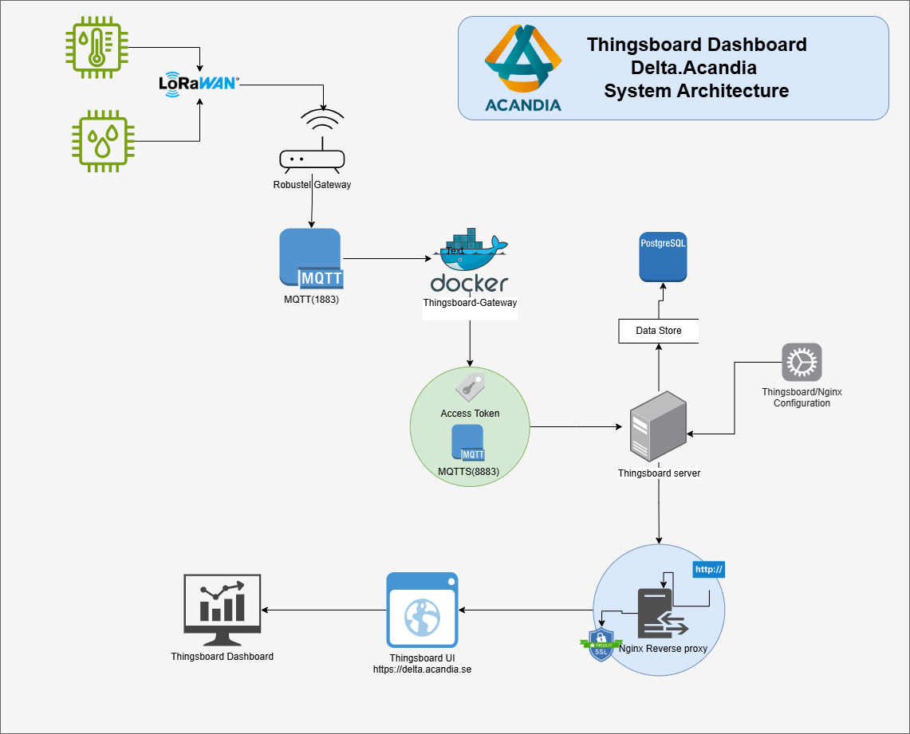
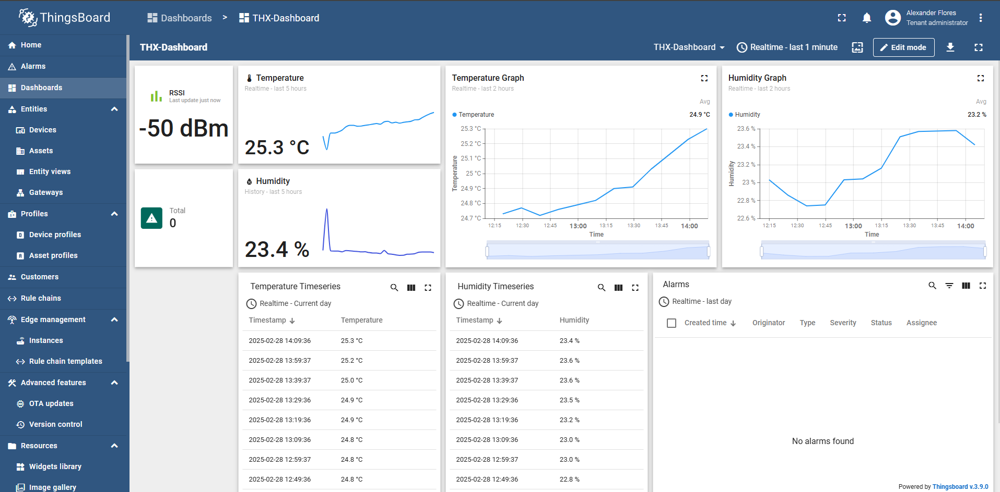
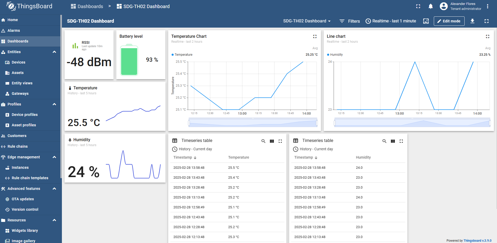
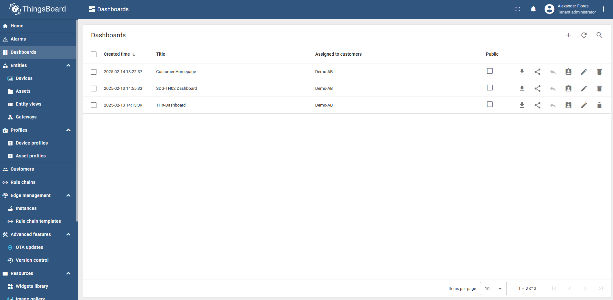
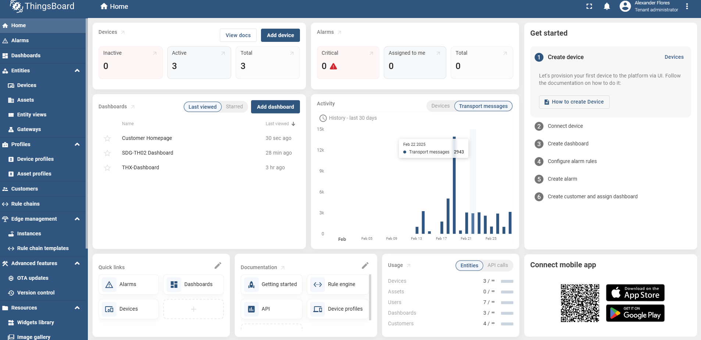

# **ThingsBoard IoT Dashboard Implementation**

### **Author**: Alexander Flores

---

## **Introduction**

This repository provides a **concise overview** of the **Delta.Acandia** project, showcasing how **ThingsBoard** is leveraged to unify and visualise multi‑vendor IoT data in a single, secure dashboard. The document highlights the project’s purpose, architecture, key challenges, scalability roadmap, and future enhancements—distilling the essentials without delving into low‑level setup details.

---

## **Why ThingsBoard and the Delta.Acandia Project?**

**Acandia’s vision** is to provide a turnkey service (*tjänst*) that lets customers **collect, visualise, and control devices from multiple suppliers in a single, vendor‑neutral portal**.
The codename for this initiative is **Delta.Acandia**, where **Δ (Delta)** represents the *change* and *translation* layer that unifies diverse data streams into one coherent experience.

### Why we chose ThingsBoard

1. **Vendor‑agnostic & multi‑protocol** – Native MQTT, HTTP, and CoAP support plus gateway extensions allow us to onboard anything from battery‑powered sensors to industrial PLCs.
2. **Rich visualisation tools** – A drag‑and‑drop dashboard builder enables rapid creation of tailored views without extra code.
3. **Rule engine & bidirectional control** – Server‑side rule chains deliver real‑time alarms, automation, and device commands in the same platform, eliminating custom glue services.
4. **Scalability & open source licence** – Horizontal scaling options and an Apache 2.0 licence align with our long‑term plan to move workloads between on‑prem and cloud without vendor lock‑in.
5. **Active community & extensibility** – Ready‑made widgets, REST APIs, and a thriving ecosystem accelerate development and reduce maintenance cost.

By building on **ThingsBoard**, **Delta.Acandia** fulfils its mission: *one dashboard where our customers can securely monitor and interact with heterogeneous IoT fleets at scale*.

---

## **System Architecture**

The following diagram illustrates the flow of data from IoT devices to the ThingsBoard dashboard:



### **Features:**

* ✅ **ThingsBoard Server** (running natively, not in Docker)
* ✅ **ThingsBoard Gateway (tb-gateway)** (Docker-based)
* ✅ **MQTT communication** for sensor data collection
* ✅ **Secure access with HTTPS & SSL/TLS**
* ✅ **Port forwarding & network setup**
* ✅ **Scalability considerations & future improvements**

---

## **System Architecture**

### **Components**

* **ThingsBoard Server**: Hosts the UI and backend logic.
* **ThingsBoard Gateway (tb-gateway)**: Handles MQTT communication with devices.
* **IoT Devices**: Send temperature and humidity data via MQTT.
* **Nginx Reverse Proxy**: Ensures HTTPS access.
* **Database**: Stores device telemetry.

### **Workflow**

1. IoT devices publish MQTT messages to **tb-gateway**.
2. The gateway forwards data to the **ThingsBoard server**.
3. The **dashboard** visualises real‑time sensor data.
4. **Nginx** ensures secure access via HTTPS.

---

## **Challenges and Troubleshooting**\*\*

### **1. Data Not Visible Over HTTPS**

* **Issue**: Data loaded in HTTP (`http://delta.acandia.se`) but not in HTTPS (`https://delta.acandia.se`).
* **Logs Showed**:

  ```
  [error] 6961#6961: *29 connect() failed (111: Connection refused) while connecting to upstream, client: 10.11.12.1, server: delta.acandia.se, request: "GET /api/ws/plugins/telemetry?token= HTTP/1.1"
  ```
* **Solution**:

  * Ensured ThingsBoard was accessible on **port 8082**.
  * Verified **SSL certificate paths** were correctly mapped.
  * Adjusted **Nginx proxy settings** to handle WebSockets (`/api/ws`).
  * Restarted `thingsboard.service` and `nginx.service`.

### **2. MQTT Connection Issues**

* **Issue**: tb-gateway could not connect securely.
* **Solution**:

  * Ensured **tb-gateway** used the same certificates as ThingsBoard.
  * Opened **port 8883** on the firewall and router.

### **3. Devices Not Updating**

* **Issue**: Devices appeared in the UI but were stuck in "loading" state.
* **Solution**:

  * Verified **MQTT logs** (`docker logs tb-gateway`).
  * Ensured devices were sending data to the correct **MQTT topic**.

---

## **Port Forwarding**

For external access, the following port forwarding was configured on the **Robustel Gateway**:

| Protocol | External Port | Internal IP | Internal Port | Purpose           |
| -------- | ------------- | ----------- | ------------- | ----------------- |
| HTTP     | 80            | 10.11.12.4  | 80            | Redirect to HTTPS |
| HTTPS    | 443           | 10.11.12.4  | 8443          | Secure UI access  |
| MQTT     | 1883          | 10.11.12.4  | 1883          | MQTT without SSL  |
| MQTT SSL | 8883          | 10.11.12.4  | 8883          | Secure MQTT       |

---

## **Scalability and Future Improvements**

### **1. Load Balancing**

* Deploy **multiple ThingsBoard instances** with **HAProxy** or **NGINX load balancing** to distribute traffic efficiently.

### **2. Cloud Hosting**

* Move the setup to **AWS or Azure** for better availability, automated scaling, and redundancy.

### **3. Database Optimization**

* Transition from the default database to **PostgreSQL** with **TimescaleDB** to handle large volumes of time‑series data.

### **4. Additional Sensor Integration**

* Expand beyond temperature and humidity to include **CO2, air quality, and motion sensors**.

### **5. AI‑Powered Analytics**

* Use **machine learning** models to predict trends and detect anomalies in sensor data.

### **6. Edge Computing**

* Deploy edge processing to reduce latency and make local decisions before sending data to ThingsBoard.

---

## **Use Cases**

This implementation can be applied to various industries:

1. **Smart Agriculture** – Monitor temperature, humidity, and soil moisture.
2. **Industrial IoT** – Track machine health, detect anomalies.
3. **Smart Cities** – Manage environmental monitoring and air quality.
4. **Home Automation** – Automate lighting, heating, and security systems.
5. **Logistics & Cold Chain** – Ensure temperature‑sensitive goods remain within required conditions.

---

## **ThingsBoard Dashboard Screenshots**

Here are screenshots showcasing the final dashboard:

### **1. Overview Dashboard**



### **2. Device Monitoring**



### **3. Available Dashboards**



### **4. Home Overview**



---

## **Conclusion**

The **Delta.Acandia** proof‑of‑concept shows how disparate device fleets can be unified under one secure, vendor‑neutral dashboard. By building on ThingsBoard, the project already delivers:

* **End‑to‑end visibility** – Real‑time telemetry, historical trends, and remote control in a single pane of glass.
* **Rapid extensibility** – A plug‑and‑play architecture that lets us onboard new sensor types or whole verticals with minimal code changes.
* **Scalable foundations** – Clear pathways for clustering, cloud deployment, and time‑series optimisation as adoption grows.

This overview is meant to align stakeholders on the project’s value and direction. The next steps will focus on pilot roll‑outs, user feedback, and incremental feature scaling—ultimately transforming **Delta.Acandia** into a full‑fledged commercial service.
