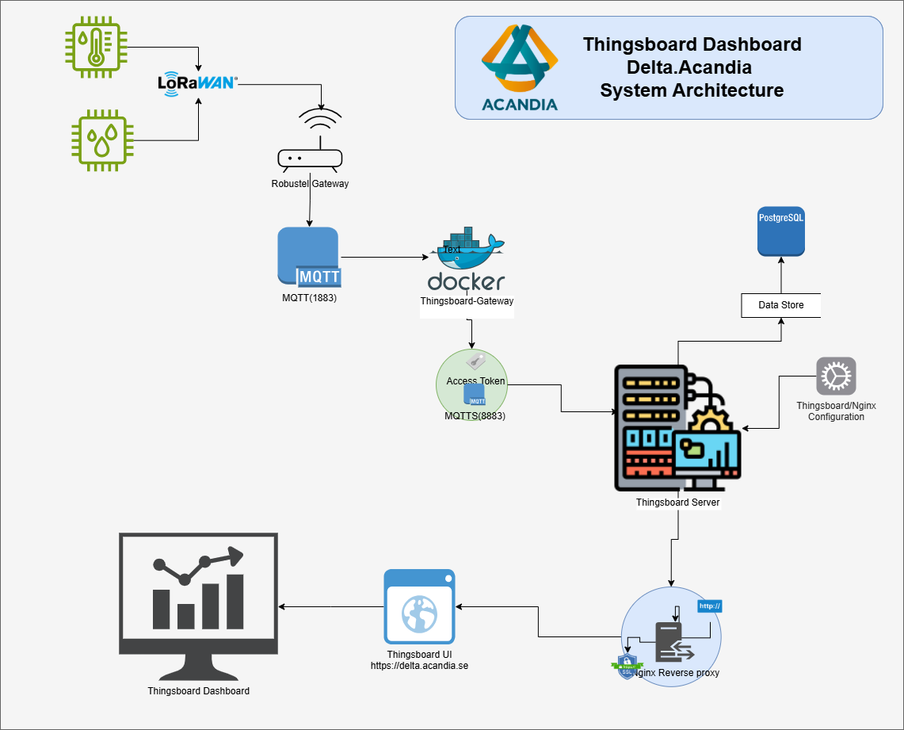

# ThingsBoard IoT Dashboard Implementation

### Author: Alexander Flores

---

## Introduction

This repository provides a **concise overview** of the **Delta.Acandia** project, showcasing how **ThingsBoard** is leveraged to unify and visualise multi-vendor IoT data in a single, secure dashboard. The document highlights the project’s purpose, architecture, key challenges, scalability roadmap, and future enhancements—distilling the essentials without delving into low-level setup details.

---

## Why ThingsBoard and the Delta.Acandia Project?

**Acandia’s vision** is to provide a turnkey service (*tjänst*) that lets customers **collect, visualise, and control devices from multiple suppliers in a single, vendor-neutral portal**.  
The codename for this initiative is **Delta.Acandia**, where **Δ (Delta)** represents the *change* and *translation* layer that unifies diverse data streams into one coherent experience.

### Why we chose ThingsBoard

1. **Vendor-agnostic & multi-protocol** – Native MQTT, HTTP, and CoAP support plus gateway extensions allow us to onboard anything from battery-powered sensors to industrial PLCs.
2. **Rich visualisation tools** – A drag-and-drop dashboard builder enables rapid creation of tailored views without extra code.
3. **Rule engine & bidirectional control** – Server-side rule chains deliver real-time alarms, automation, and device commands in the same platform, eliminating custom glue services.
4. **Scalability & open source licence** – Horizontal scaling options and an Apache 2.0 licence align with our long-term plan to move workloads between on-prem and cloud without vendor lock-in.
5. **Active community & extensibility** – Ready-made widgets, REST APIs, and a thriving ecosystem accelerate development and reduce maintenance cost.

By building on **ThingsBoard**, **Delta.Acandia** fulfils its mission: *one dashboard where our customers can securely monitor and interact with heterogeneous IoT fleets at scale*.

---

## System Architecture

The following diagram illustrates the flow of data from IoT devices to the ThingsBoard dashboard:



### Features

- ✅ **ThingsBoard Server** (running natively, not in Docker)  
- ✅ **ThingsBoard Gateway (tb-gateway)** (Docker-based)  
- ✅ **MQTT communication** for sensor data collection  
- ✅ **Secure access with HTTPS & SSL/TLS**  
- ✅ **Port forwarding & network setup**  
- ✅ **Scalability considerations & future improvements**

---

## Components

- **ThingsBoard Server**: Hosts the UI and backend logic.
- **ThingsBoard Gateway (tb-gateway)**: Handles MQTT communication with devices and external brokers.
- **IoT Devices**: Send temperature, humidity and other telemetry via MQTT.
- **Nginx Reverse Proxy**: Ensures HTTPS access.
- **Database (PostgreSQL)**: Stores entities (devices, dashboards, assets) and time-series telemetry.

### Workflow

1. IoT devices (and external systems like ChirpStack) publish MQTT messages to **tb-gateway**.
2. The gateway normalises topics/payloads and forwards data to the **ThingsBoard server**.
3. The **dashboard** visualises real-time and historical sensor data.
4. **Nginx** ensures secure access via HTTPS.

---

## Challenges and Troubleshooting

### 1. Data Not Visible Over HTTPS

- **Issue**: Data loaded in HTTP (`http://delta.acandia.se`) but not in HTTPS (`https://delta.acandia.se`).
- **Logs showed**:

  ```text
  connect() failed (111: Connection refused) while connecting to upstream
  request: "GET /api/ws/plugins/telemetry?token= HTTP/1.1"
  ```

- **Solution**:
  - Ensured ThingsBoard was listening on the correct **internal port** for WebSockets.
  - Verified **SSL certificate paths** in Nginx and ThingsBoard config.
  - Adjusted **Nginx proxy settings** to handle WebSockets (`/api/ws`).
  - Restarted `thingsboard.service` and `nginx.service`.

---

### 2. MQTT / tb-gateway Connection Issues

- **Symptoms**:
  - `tb-gateway` logs looping on: `Connecting to ThingsBoard...`
  - `Sending connect to <host>:<port>` with no successful session.

- **Root causes encountered**:
  - Wrong host/port (1883 vs 8883) or TLS flag mismatch.
  - Confusion between external DNS (`delta.acandia.se`) and internal IP (`10.11.12.4`).

- **Solutions**:
  - Standardised on:
    - **MQTT (no TLS)**: port `1883`
    - **MQTT over TLS**: port `8883` with proper certificates
  - Mapped Let’s Encrypt certs into the tb-gateway Docker container when TLS was enabled.
  - Ensured the gateway used a valid **access token** from the ThingsBoard device representing the gateway.

---

### 3. ChirpStack Integration (ROS Router MQTT Broker)

The **Robustel / ROS router** runs a local Mosquitto broker and ChirpStack. ChirpStack publishes LoRaWAN device events to topics such as:

```text
application/+/device/+/event/up
```

An example payload:

```json
{
  "deviceInfo": {
    "deviceName": "ACW/LW8-THX",
    "devEui": "0080e115051d4d92",
    "applicationName": "ros-app"
  },
  "fCnt": 1568,
  "fPort": 5,
  "object": {
    "humidity0": { "value": [44.6], "unit": "%" },
    "temperature0": { "value": [22.72], "unit": "°C" }
  }
}
```

To bridge these into ThingsBoard, a **custom MQTT connector** in **tb-gateway** is used with a mapping like:

```json
{
  "topicFilter": "application/+/device/+/event/up",
  "subscriptionQos": 0,
  "converter": {
    "type": "json",
    "deviceInfo": {
      "deviceNameExpressionSource": "message",
      "deviceNameExpression": "${deviceInfo.devEui}",
      "deviceProfileExpressionSource": "constant",
      "deviceProfileExpression": "chirpstack-device"
    },
    "sendDataOnlyOnChange": false,
    "timeout": 60000,
    "attributes": [
      {
        "type": "string",
        "key": "application",
        "value": "${deviceInfo.applicationName}"
      },
      {
        "type": "string",
        "key": "deviceName",
        "value": "${deviceInfo.deviceName}"
      }
    ],
    "timeseries": [
      {
        "type": "double",
        "key": "temperature",
        "value": "${object.temperature0.value[0]}"
      },
      {
        "type": "double",
        "key": "humidity",
        "value": "${object.humidity0.value[0]}"
      },
      {
        "type": "long",
        "key": "fCnt",
        "value": "${fCnt}"
      }
    ]
  }
}
```

**Result**: Every LoRaWAN device seen by ChirpStack is automatically represented in ThingsBoard as a device (keyed by `devEui`), with temperature/humidity time-series.

---

### 4. Platform Upgrade & Database Migration (ThingsBoard 3.9 → 4.2.x)

During an upgrade from **ThingsBoard 3.9.0** to **4.2.1**, a few important lessons were learned.

#### Problem

- The upgrade script reported:

  > `Upgrade failed: database version '3.9.0' is not supported for upgrade. Supported versions are: [4.2.0].`

- After troubleshooting, the `thingsboard` PostgreSQL database was **dropped** and a clean 4.2.1 install was executed.
- ThingsBoard came back up, but **all previous dashboards, devices, rule chains and telemetry were gone**, as they lived in PostgreSQL.

#### Root Cause

- PostgreSQL contained the authoritative data (`tb_schema_settings` showed `schema_version = 3009000` = 3.9.0).
- The `/var/backups/thingsboard-data-3.9.0-YYYY-MM-DD.tar.gz` archive contained **application files and SQL schema scripts**, not a full database dump.
- Dropping the database effectively wiped all tenant data; there was no separate `pg_dump` backup to restore from.

#### Resolution

- Performed a **clean install** of ThingsBoard 4.2.1.
- Reconfigured:
  - PostgreSQL connection.
  - MQTT, HTTPS, and tb-gateway.
  - ChirpStack MQTT connector mappings.
- Recreated key dashboards and devices.

Functionally, the platform is now **clean and working**, but historical data from 3.9.0 is lost on this instance.

#### Future-Proofing / How to Avoid This Next Time

1. **Always snapshot or `pg_dump` before upgrading**

   Before any major ThingsBoard upgrade:

   ```bash
   sudo -u postgres pg_dump -Fc thingsboard > /var/backups/thingsboard-$(date +%F).dump
   ```

   Optionally, take a **VM or filesystem snapshot** if running under Proxmox/VMware/cloud.

2. **Respect the documented upgrade path**

   - Upgrade sequentially: e.g. `3.9.x → 4.2.0 → 4.2.1`, using the official `upgrade.sh` for each supported step.
   - Always check `tb_schema_settings.schema_version` to understand what DB schema you are on.

3. **Test upgrades on a clone**

   - Restore the `pg_dump` to a **test database/server**.
   - Run `upgrade.sh` there first.
   - Only upgrade production once the procedure is validated.

4. **Keep gateway & connectors configuration under version control**

   - Store:
     - `/etc/thingsboard/conf/thingsboard.conf`
     - tb-gateway `docker-compose.yml`
     - connector JSON (e.g. `mqtt.json` with mappings)  
   - in a Git repo (this one), so they can be quickly restored even if the DB is rebuilt.

---

## Port Forwarding

For external access, the following port forwarding was configured on the **Robustel Gateway**:

| Protocol | External Port | Internal IP | Internal Port | Purpose           |
| -------- | ------------- | ----------- | ------------- | ----------------- |
| HTTP     | 80            | 10.11.12.4  | 80            | Redirect to HTTPS |
| HTTPS    | 443           | 10.11.12.4  | 8443          | Secure UI access  |
| MQTT     | 1883          | 10.11.12.4  | 1883          | MQTT without SSL  |
| MQTT SSL | 8883          | 10.11.12.4  | 8883          | Secure MQTT       |

---

## Backup & Upgrade Strategy (Operational Runbook)

To protect Delta.Acandia as it grows, the following operational practices are recommended.

### 1. Nightly PostgreSQL Backups

Cron job as `postgres`:

```bash
0 2 * * * pg_dump -Fc thingsboard > /var/backups/thingsboard-$(date +\%F).dump
```

Optionally rotate / sync to off-site storage.

### 2. Config Backup

Regularly commit:

- `/etc/thingsboard/conf/thingsboard.conf`
- Nginx site config for `delta.acandia.se`
- tb-gateway `docker-compose.yml` and connector JSONs  

to this repo.

### 3. Documented Restore Test

At least once, perform a test restore into a lab VM using:

```bash
createdb thingsboard_restore
pg_restore -d thingsboard_restore /var/backups/thingsboard-YYYY-MM-DD.dump
```

Verify dashboards/devices show up correctly.

### 4. Planned Upgrade Procedure

- Freeze changes, take database + VM snapshot, then upgrade along the supported path.
- Rollback plan: restore snapshot or `pg_restore` if the upgrade fails.

---

## Scalability and Future Improvements

### 1. Load Balancing

- Deploy **multiple ThingsBoard instances** with **HAProxy** or **NGINX load balancing** to distribute traffic efficiently.

### 2. Cloud Hosting

- Move the setup to **AWS or Azure** for better availability, automated scaling, and redundancy.

### 3. Database Optimization

- Continue using **PostgreSQL** and optionally **TimescaleDB** for large-volume time-series data.
- Combine with the backup strategy above for safe, scalable growth.

### 4. Additional Sensor Integration

- Expand beyond temperature and humidity to include **CO₂, air quality, and motion sensors**, plus more LoRaWAN device profiles in ChirpStack.

### 5. AI-Powered Analytics

- Use **machine learning** models to predict trends and detect anomalies in sensor data.

### 6. Edge Computing

- Deploy edge processing to reduce latency and make local decisions before sending data to ThingsBoard.

---

## Use Cases

This implementation can be applied to various industries:

1. **Smart Agriculture** – Monitor temperature, humidity, and soil moisture.
2. **Industrial IoT** – Track machine health, detect anomalies.
3. **Smart Cities** – Manage environmental monitoring and air quality.
4. **Home Automation** – Automate lighting, heating, and security systems.
5. **Logistics & Cold Chain** – Ensure temperature-sensitive goods remain within required conditions.

---

## ThingsBoard Dashboard Screenshots

### 1. Overview Dashboard


### 2. Device Monitoring


### 3. Available Dashboards


### 4. Home Overview


---

## Conclusion

The **Delta.Acandia** proof-of-concept shows how disparate device fleets can be unified under one secure, vendor-neutral dashboard. By building on ThingsBoard, the project already delivers:

- **End-to-end visibility** – Real-time telemetry, historical trends, and remote control in a single pane of glass.
- **Rapid extensibility** – A plug-and-play architecture that lets us onboard new sensor types or whole verticals with minimal code changes.
- **Scalable foundations** – Clear pathways for clustering, cloud deployment, and time-series optimisation as adoption grows.
- **Operational maturity** – A documented backup and upgrade strategy that protects customer data even as the platform evolves.

The next steps will focus on pilot roll-outs, user feedback, and incremental feature scaling—ultimately transforming **Delta.Acandia** into a full-fledged commercial service.
